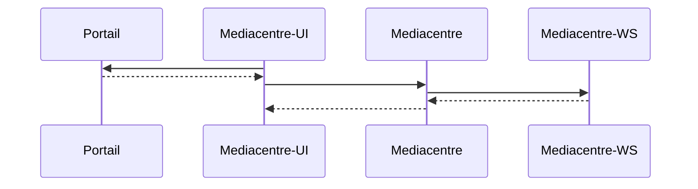
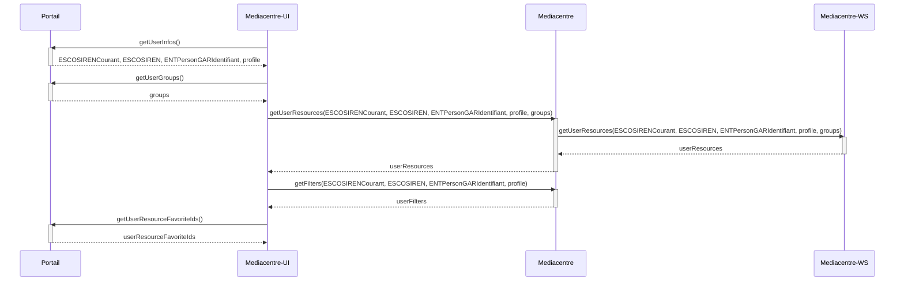

# Mediacentre

- [Mediacentre](#mediacentre)
  - [Fonctionnement global](#fonctionnement-global)
    - [Cas d'utilisation](#cas-dutilisation)
  - [Attributs utilisateurs](#attributs-utilisateurs)
  - [Endpoints API externes](#endpoints-api-externes)
  - [Documentations complémentaires](#documentations-complémentaires)

## Fonctionnement global

**Mediacentre** est une application permettant à un utilisateur d'accéder et gèrer ses ressources numériques éducatives fournies principalement par le GAR.

Il est composé de : 
- [Mediacentre-UI](https://github.com/GIP-RECIA/Mediacentre-UI.git) : un composant web Vue.JS 3 (front). 
- [Mediacentre](https://github.com/GIP-RECIA/MediaCentre.git) : une API REST SpringBoot 2 (back).

Le diagramme de séquence suivant montre les interactions globales entre les différents composants du Mediacentre : 



### Cas d'utilisation 

Au démarrage du Mediacentre-UI, le composant web contacte les API du portail *oidc-user-info-controller* et *group-rest-controller* pour récupèrer un JWT token contenant les informations utilisateurs demandées et récupère également les droits de l'utilisateur. 

Après cela, il contacte l'API REST Mediacentre pour récupèrer les ressources utilisateur en passant le JWT token et les droits utilisateur. Le JWT token permet de vérifier dans le Mediacentre si l'utilisateur est bien connecté au portail et sécurise les informations utilisateurs transmises. 

Les informations utilisateurs contenues dans le JWT token et les droits utilisateur sont requis pour le bon fonctionnement du Mediacentre-WS. Ils lui sont donc transmis dans une requete HTTP pour la récuperation des ressources utilisateur. Une fois récupèrées, elles sont transmises au Mediacentre-UI. 

Enfin Mediacentre-UI contacte Mediacentre pour récupèrer des catégories de filtrage. Ces catégories de filtrage sont définies par Mediacentre en fonction de l'attribut utilisateur *profile*. Par exemple, un professeur pourra avoir des filtres en fonction des établissements ou il enseigne ou encore par niveau scolaire. Une fois les catégories de filtrage récupèrées par Mediacentre-UI, il vient créer dynamiquement des filtres en fonction des catégories de filtrage et des ressources utilisateur récupérées. 

Concernant la gestion des ressources favorites de l'utilisateur, en fonction de si c'est un ajout ou une suppression d'une ressource favorite, Mediacentre-UI contacte l'API du portail *portlet-prefs-rest-controller* en lui donnant une nouvelle liste d'identifiants des ressources favorites de l'utilisateur.




## Attributs utilisateurs

Les attributs utilisateurs utilisés par le Mediacentre sont : 
- **ESCOSIRENCourant** : identifiant de l'établissement courant de l'utilisateur.
- **ESCOSIREN** : identifiants des établissements de l'utilisateur.
- **ENTPersonGARIdentifiant** : identifiant GAR de l'utilisateur.
- **profile** : catégorie de personne dans le domaine éducatif (ex : professeur, élève, etc).
- **groups** : droits de l'utilisateur.
- **mediacentreFavorites** : identifiants des ressources numériques éducatives préfèrées de l'utilisateur.

## Endpoints API externes

Mediacentre contacte plusieures API externes pour récupèrer ces informations. 

Il contacte donc : 

- Depuis Mediacentre-UI : 
  - ```/portail/api/v5-1/userinfo?claims=private,ESCOSIRENCourant,ESCOSIREN,ENTPersonGARIdentifiant,profile&groups=``` : API portail [oidc-user-info-controller](https://test-lycee.giprecia.net/portail/api/swagger-ui.html#/oidc-user-info-controller/userInfoUsingGET) pour la récupération des informations utilisateur.
  - ```/portail/api/groups``` : API portail [group-rest-controller](https://test-lycee.giprecia.net/portail/api/swagger-ui.html#/group-rest-controller/getUsersGroupUsingGET_1) pour la récupération des groupes de l'utilisateur.
  - ```/portail/api/prefs/getentityonlyprefs/``` : API portail [portlet-prefs-rest-controller](https://test-lycee.giprecia.net/portail/api/swagger-ui.html#/portlet-prefs-rest-controller/getEntityOnlyPrefsUsingGET) pour la récupération des identifiants des ressources numériques éducatives préférées de l'utilisateur.
  - ```/portail/api/prefs/putprefs?fname=``` : API portail [portlet-prefs-rest-controller](https://test-lycee.giprecia.net/portail/api/swagger-ui.html#/portlet-prefs-rest-controller/getEntityOnlyPrefsUsingGET) pour la modification des ressources numériques éducatives préférées de l'utilisateur.
  
- Depuis Mediacentre : 
  - ```/mediacentre-ws/api/ressources/``` : API [Mediacentre-WS](https://github.com/GIP-RECIA/MediaCentre-WS.git) pour la récupération des ressources numériques éducatives de l'utilisateur.

## Documentations complémentaires

Pour plus de documentation spécifique concernant les composants interne du Mediacentre : 
- Mediacentre
  - [documentation de support](https://github.com/GIP-RECIA/MediaCentre/blob/8518ec7beb6775d9f504ebb07d61d0e67f8b63b7/docs/dev.md)
- Mediacentre-UI
  - [documentation générale](https://github.com/GIP-RECIA/Mediacentre-UI/blob/bef742a4554853564c44b3fb38c48bc0e620d199/README.md)